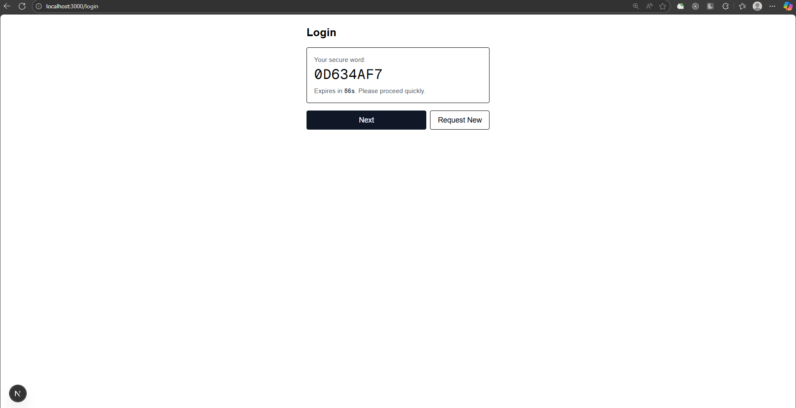
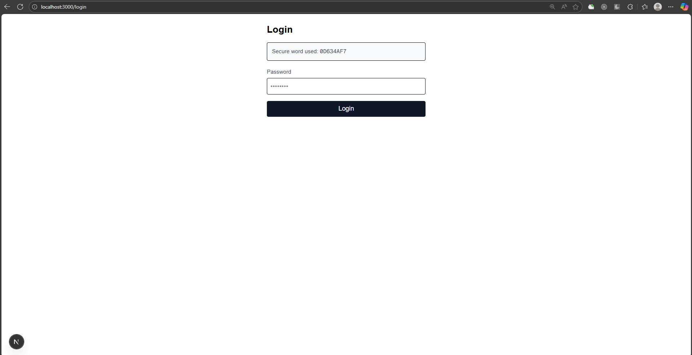
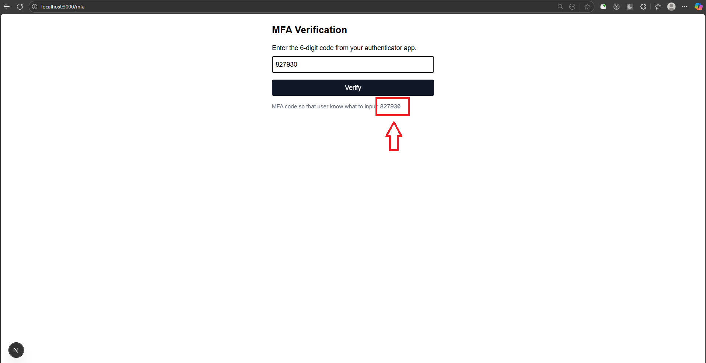

This is a [Next.js](https://nextjs.org) project bootstrapped with [`create-next-app`](https://nextjs.org/docs/app/api-reference/cli/create-next-app).

## Getting Started

Requirement

```bash
nodejs LTS
```

First, run this commands:

```bash
npm install
npm run dev
```

Open [http://localhost:3000](http://localhost:3000) with your browser to see the result.

First you will this pages


When you click Login button, it will directed to the login page
Input your Username and then click Get Secure Word button


You got 60s to click Next button before the Secure Word is expired


After that, input your password


Then you go to MFA Verification page,
for demo purpose, the code is displayed below Verify button


After success, it will go to dashboard where you can see the Transaction History Table

